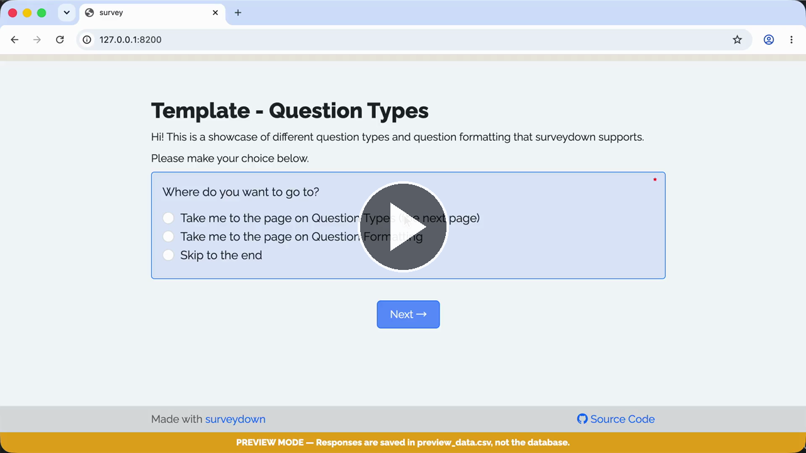

# Template - Question Types

A template showcasing all built-in question types.

### See it in action

**Live demo:** https://surveydown-question-types.share.connect.posit.cloud

**Walkthrough recording:**

[](https://cdn.jsdelivr.net/gh/surveydown-dev/template_question_types@8e001f4e0999a0ce805b78dbeece29d0a10ab26e/video-recording.mp4)

### Create this template

Run this command in your R console:

```r
surveydown::sd_create_survey(
  #path = "path/to/survey",
  template = "question_types"
)
```

### Learn more

- [Template page - Question Types](https://surveydown.org/templates/question_types)
- [Document page - Question types](https://surveydown.org/docs/question-types)
- [Document page - Start with a template](https://surveydown.org/docs/getting-started#start-with-a-template)
